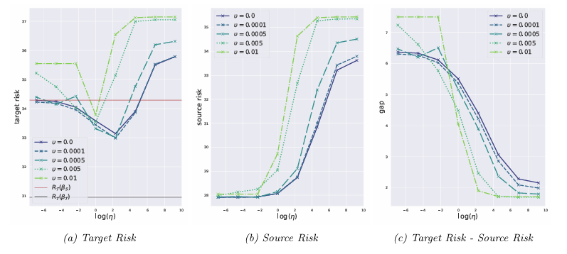

---

##### Download

+ [Paper](paper1.pdf)
+ [arxiv](https://arxiv.org/pdf/2406.15904)

---

##### Abstract

 Practitioners often deploy a learned prediction model in a new environment where the joint
 distribution of covariate and response has shifted. In observational data, the distribution shift is
 often driven by unobserved confounding factors lurking in the environment, with the underlying
 mechanism unknown. Confounding can obfuscate the definition of the best prediction model
 (concept shift) and shift covariates to domains yet unseen (covariate shift). Therefore, a model
 maximizing prediction accuracy in the source environment could suffer a significant accuracy
 drop in the target environment. This motivates us to study the domain adaptation problem
 with observational data: given labeled covariate and response pairs from a source environment,
 and only unlabeled covariates from a target environment, how can one predict the missing target
 response reliably? We root the adaptation problem in a linear structural causal model to ad
dress endogeneity and unobserved confounding. We study the necessity and benefit of leveraging
 exogenous, invariant covariate representations to cure concept shifts and improve target predic
tion. This further motivates a new data-driven representation learning method for adaptation
 that optimizes for a lower-dimensional linear subspace and, subsequently, a prediction model
 confined to that subspace. The procedure operates on a non-convex objective—that naturally
 interpolates between predictability and stability/invariance—constrained on the Stiefel mani
fold, using an analog of projected gradient descent on manifolds. We study the optimization
 landscape and prove that, when the regularization is sufficient, nearly all local optima align
 with an invariant linear subspace resilient to both the concept shift and the covariate shift.
 In terms of predictability, we show a predictive model that uses the learned lower-dimensional
 subspace can incur a nearly ideal gap between target and source risk. Three real-world data
 sets are investigated to validate our method and theory against distribution shifts empirically;
 the tradeoffs between predictability and stability are elucidated therein
 
---

##### Figure 6: Domain Adaptation, and Risk Difference



---

##### Citation

Kulunu Dharmakeerthi, YoonHaeng Hur, and Tengyuan Liang. 2024. “Learning When the Concept Shifts: Confounding, Invariance, and Dimension Reduction.” arXiv:2406.15904.

```BibTeX
@misc{dharmakeerthi2024learning,
      title={Learning When the Concept Shifts: Confounding, Invariance, and Dimension Reduction}, 
      author={Kulunu Dharmakeerthi and YoonHaeng Hur and Tengyuan Liang},
      year={2024},
      eprint={2406.15904},
      archivePrefix={arXiv},
      primaryClass={cs.LG}
}
```

---

##### Related material
