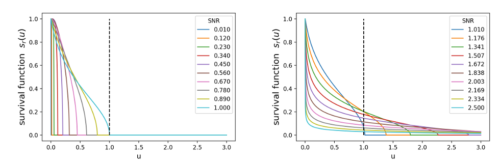

---

##### Download

+ [Paper](paper2.pdf)
+ [arxiv](https://arxiv.org/pdf/2411.01629)

---

##### Abstract

Adding noise is easy; what about denoising? Diffusion is easy; what about reverting a
diffusion? Diffusion-based generative models aim to denoise a Langevin diffusion chain, moving
from a log-concave equilibrium measure ν, say isotropic Gaussian, back to a complex, possibly
non-log-concave initial measure μ. The score function performs denoising, going backward in
time, predicting the conditional mean of the past location given the current. We show that
score denoising is the optimal backward map in transportation cost. What is its localization
uncertainty? We show that the curvature function determines this localization uncertainty,
measured as the conditional variance of the past location given the current. We study in
this paper the effectiveness of the diffuse-then-denoise process: the contraction of the forward
diffusion chain, offset by the possible expansion of the backward denoising chain, governs the
denoising difficulty. For any initial measure μ, we prove that this offset net contraction at time
t is characterized by the curvature complexity of a smoothed μ at a specific signal-to-noise ratio
(SNR) scale r(t). We discover that the multi-scale curvature complexity collectively determines
the difficulty of the denoising chain. Our multi-scale complexity quantifies a fine-grained notion
of average-case curvature instead of the worst-case. Curiously, it depends on an integrated
tail function, measuring the relative mass of locations with positive curvature versus those with
negative curvature; denoising at a specific SNR scale is easy if such an integrated tail is light. We
conclude with several non-log-concave examples to demonstrate how the multi-scale complexity
probes the bottleneck SNR for the diffuse-then-denoise process
---

##### Figure 2: Survival Function: Localization of Backward Transport



---

##### Citation

Tengyuan Liang, Kulunu Dharmakeerthi, and Takuya Koriyama. 2024. “Denoising Diffusions with Optimal Transport: Localization, Curvature, and Multi-Scale Complexity.” arXiv:2411.01629.

```BibTeX
@misc{liang2024denoising,
      title={Denoising Diffusions with Optimal Transport: Localization, Curvature, and Multi-Scale Complexity}, 
      author={Tengyuan Liang and Kulunu Dharmakeerthi and Takuya Koriyama},
      year={2024},
      eprint={2411.01629},
      archivePrefix={arXiv},
      primaryClass={stat.ML}
}

```

---

##### Related material
