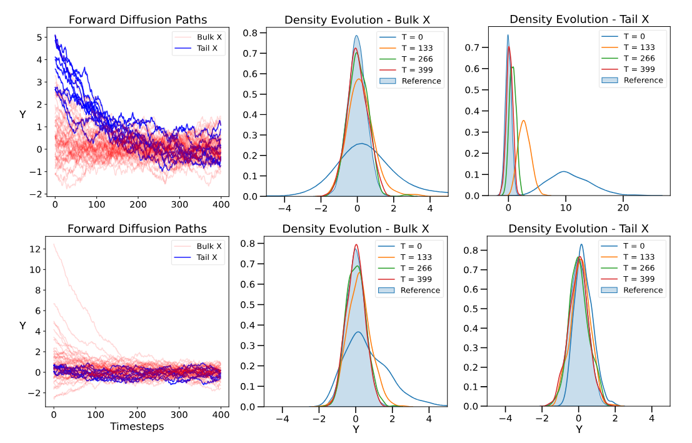

---

##### Download

+ [Paper](paper3.pdf)
+ [arxiv](https://arxiv.org/pdf/2510.02499?)

---

##### Abstract

Diffusion models have emerged as powerful generative frameworks with
widespread applications across machine learning and artificial intelligence systems.
While current research has predominantly focused on linear diffusions, these ap-
proaches can face significant challenges when modeling a conditional distribution,
P (Y |X = x), when P (X = x) is small. In these regions, few samples, if any, are
available for training, thus modeling the corresponding conditional density may
be difficult. Recognizing this, we show it is possible to adapt the data representa-
tion and forward scheme so that the sample complexity of learning a score-based
generative model is small in low probability regions of the conditioning space.
Drawing inspiration from conditional extreme value theory we characterize this
method precisely in the special case in the tail regions of the conditioning variable,
X. We show how diffusion with a data-driven choice of nonlinear drift term is best
suited to model tail events under an appropriate representation of the data. Through
empirical validation on two synthetic datasets and a real-world financial dataset,
we demonstrate that our tail-adaptive approach significantly outperforms standard
diffusion models in accurately capturing response distributions at the extreme tail
conditions

---

##### Figure 2: Survival Function: Localization of Backward Transport



---

##### Citation

Dharmakeerthi, Kulunu, et al. "Beyond Linear Diffusions: Improved Representations for Rare Conditional Generative Modeling." arXiv preprint arXiv:2510.02499 (2025).
```BibTeX
@article{dharmakeerthi2025beyond,
  title={Beyond Linear Diffusions: Improved Representations for Rare Conditional Generative Modeling},
  author={Dharmakeerthi, Kulunu and El-Laham, Yousef and Wong, Henry H and Potluru, Vamsi K and He, Changhong and He, Taosong},
  journal={arXiv preprint arXiv:2510.02499},
  year={2025}
}
```

---

##### Related material
